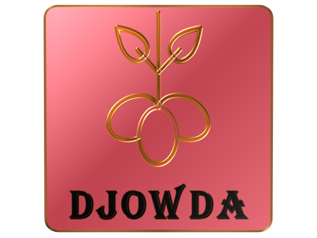
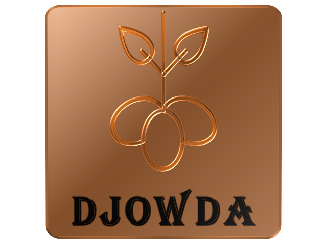
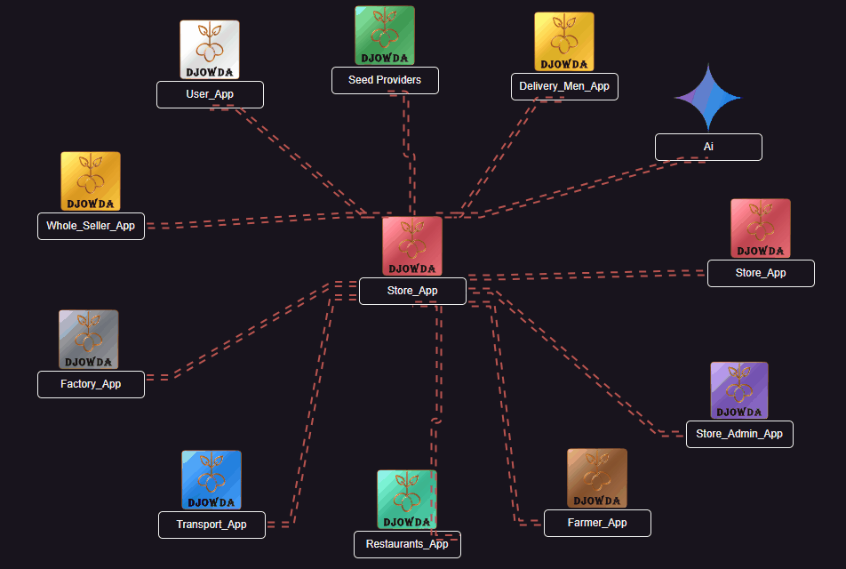

## Djowda-StoreApp (Work in progress...)

### Introduction

**Brief Overview of the Store App: Its Purpose and Role in the Djowda Platform**

The Djowda Store App is designed to empower store owners with an intuitive and efficient platform for managing their business operations within the Djowda ecosystem. Acting as a central node, the Store App bridges the gap between customers, delivery personnel, and administrators, ensuring seamless interaction and smooth order processing.

The primary purpose of the Store App is to provide store owners with tools to manage product inventory, track orders, and communicate with other stakeholders in the Djowda platform. Beyond operational tasks, the app also offers features for education and collaboration, fostering community engagement and sustainable practices.

By integrating directly with other apps in the ecosystem (such as the User App and Delivery App), the Store App ensures real-time updates and streamlined workflows, making it a key component of the Djowda platform.

### High-Level Benefits and Features for Store Owners

**Streamlined Operations:**

* Easily manage product inventory, update availability, and handle customer orders all in one place.

**Real-Time Insights:**

* Stay updated with daily sales analytics, low-stock alerts, and order trends to optimize operations.

**Customer Engagement:**

* View and respond to user feedback, fostering trust and improving service quality.

**Seamless Integration:**

* Connect with the User App for order management and the Delivery App for efficient logistics coordination.
* Educational Content: Access tutorials, articles, and tips on sustainable store management, waste reduction, and maximizing profitability.
* Collaboration Features: Collaborate with other store owners and stakeholders through a built-in community hub. Share best practices, tips, and insights with peers to improve the overall ecosystem.
* Flexibility for Store Operations: Manage store availability with scheduling tools and role-based permissions for store workers.
* Future-Ready Platform: Built with scalability and future features like AI-driven stock recommendations and offline functionality in mind.

### Store App Interactions with Other Apps

| App                  | Direct Interaction with Store App? | Indirect Interaction with Store App? |
|----------------------|:----------------------------------:|:------------------------------------:|
|  User App           | X                                   |                                      |
|  Delivery Men App   | X                                   |                                      |
|  Store App    | X           
|  Store Admin App    | X                          |                                      |
|  Transport App        | X                                   |                                      |
|  Restaurants App    | X                                   |                                      |
|  Factory App          | X                                   |                                      |
|  Whole Seller App   | X                                   |                                      |
|  Farmer App         | X                                   |                                      |
|  App for Seed Providers | X                             |                                      |
|  AI Assistance      | X                                   |                                      |

